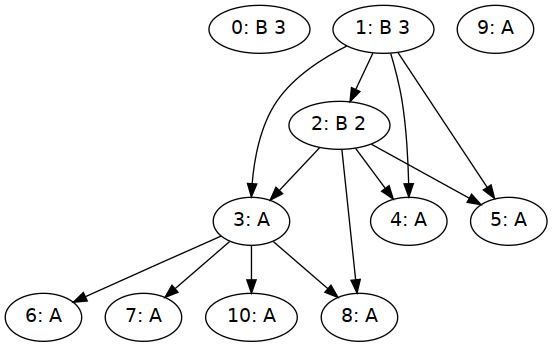

slides: [slides.pdf](slides.pdf)  

formulation: [src/Sched.hs](src/Sched.hs)  

example: [src/Example.hs](src/Example.hs)  

other files vendored from [glpk-hs](https://github.com/jyp/glpk-hs)  

## playground
```
# in nix-shell:
cabal configure $(tr <<< "$NIX_LDFLAGS" ' ' '\n' | sed 's|-L|--extra-lib-dirs=|;t;d')
feh --reload 0.1 exampleProblem.png &
feh --reload 0.1 schedule.png &
ghcid --test=Sched.example
```

## example
`Sched.example` implements a 3 machine problem instance using the following graph.



generated GLPK file: [example.ilp](example.ilp)  

generated output: [output.txt](output.txt)  


example run:
```
$(nix-build -A haskellPackages.ilpsched --no-out-link)/bin/example-ilpsched
# or in nix-shell:
cabal v2-run example-ilpsched
```
